# 🏗️ ПОЛНАЯ АРХИТЕКТУРНАЯ ДИАГРАММА IT-CUBE TELEGRAM BOT

## 📊 ОБЩАЯ АРХИТЕКТУРА СИСТЕМЫ

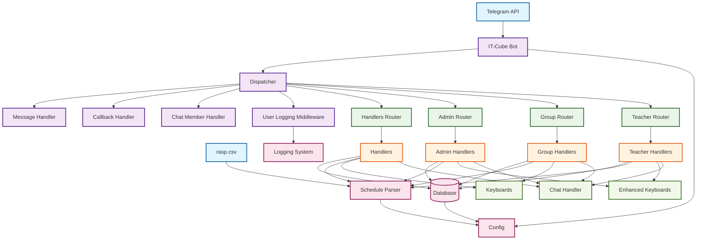

## 🔄 ПОТОК ОБРАБОТКИ СООБЩЕНИЙ

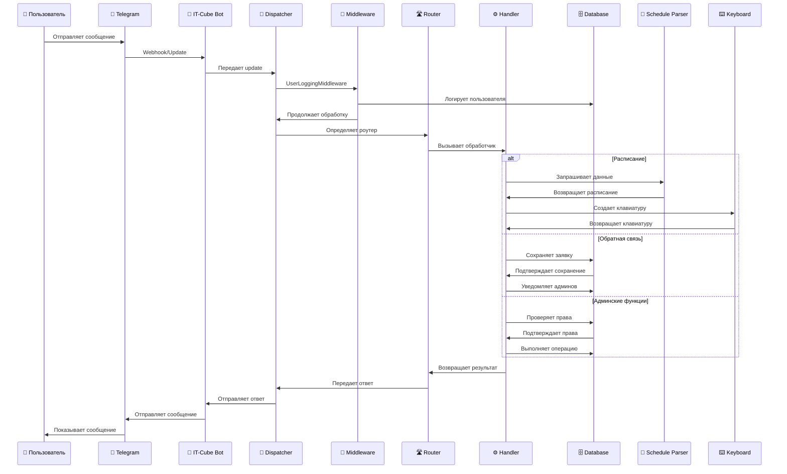

## 🏛️ ДЕТАЛЬНАЯ СТРУКТУРА БАЗЫ ДАННЫХ

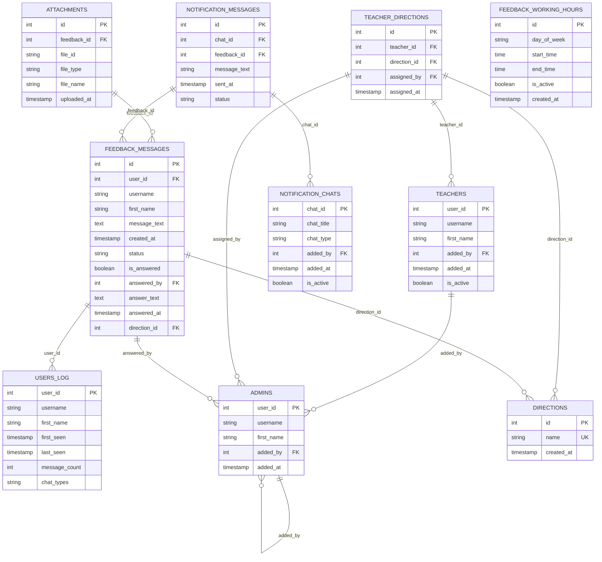

## 🎯 СИСТЕМА РОЛЕЙ И ПРАВ ДОСТУПА

```mermaid
graph TD
    %% Типы пользователей
    USER[👤 Обычный пользователь] --> USER_RIGHTS[📋 Права пользователя]
    ADMIN[👑 Администратор] --> ADMIN_RIGHTS[🔐 Права администратора]
    TEACHER[👨‍🏫 Преподаватель] --> TEACHER_RIGHTS[📚 Права преподавателя]
    
    %% Права пользователя
    USER_RIGHTS --> U1[📅 Просмотр расписания]
    USER_RIGHTS --> U2[💬 Отправка обратной связи]
    USER_RIGHTS --> U3[📱 Использование базовых команд]
    
    %% Права администратора
    ADMIN_RIGHTS --> A1[✅ Все права пользователя]
    ADMIN_RIGHTS --> A2[👥 Управление администраторами]
    ADMIN_RIGHTS --> A3[👨‍🏫 Управление преподавателями]
    ADMIN_RIGHTS --> A4[🎫 Управление заявками]
    ADMIN_RIGHTS --> A5[📊 Просмотр статистики]
    ADMIN_RIGHTS --> A6[⚙️ Настройка уведомлений]
    ADMIN_RIGHTS --> A7[🕐 Настройка рабочих часов]
    ADMIN_RIGHTS --> A8[📢 Массовые рассылки]
    
    %% Права преподавателя
    TEACHER_RIGHTS --> T1[✅ Все права пользователя]
    TEACHER_RIGHTS --> T2[📝 Просмотр заявок по направлениям]
    TEACHER_RIGHTS --> T3[💬 Ответы на заявки студентов]
    TEACHER_RIGHTS --> T4[📅 Быстрый доступ к расписанию]
    
    %% Проверка прав
    CHECK[🔍 Проверка прав] --> PERMISSION[✅ Разрешение/❌ Отказ]
    PERMISSION --> EXECUTE[⚙️ Выполнение команды]
    PERMISSION --> DENY[🚫 Сообщение об отказе]
    
    %% Middleware для проверки
    MW[🔗 UserLoggingMiddleware] --> LOG[📝 Логирование]
    MW --> RIGHTS[🔐 Проверка роли]
    RIGHTS --> ROUTER[🛣️ Маршрутизация]
```

## 📅 СИСТЕМА РАСПИСАНИЯ

```mermaid
graph LR
    %% Источник данных
    CSV[📄 rasp.csv] --> SP[📅 Schedule Parser]
    
    %% Структура данных
    SP --> DIR[🎯 Направления]
    SP --> TEACH[👨‍🏫 Преподаватели]
    SP --> ROOM[🏢 Кабинеты]
    SP --> SCHED[📅 Расписание по дням]
    
    %% Направления
    DIR --> D1[💻 Программирование]
    DIR --> D2[🎨 Дизайн]
    DIR --> D3[🤖 Робототехника]
    DIR --> D4[🌐 Веб-разработка]
    DIR --> D5[📱 Мобильные приложения]
    
    %% Дни недели
    SCHED --> DAY1[📅 Понедельник]
    SCHED --> DAY2[📅 Вторник]
    SCHED --> DAY3[📅 Среда]
    SCHED --> DAY4[📅 Четверг]
    SCHED --> DAY5[📅 Пятница]
    SCHED --> DAY6[📅 Суббота]
    
    %% Обработка расписания
    SP --> PARSE[🔍 Парсинг]
    PARSE --> FORMAT[📝 Форматирование]
    FORMAT --> DISPLAY[📱 Отображение]
    
    %% Синхронизация с БД
    SP --> SYNC[🔄 Синхронизация]
    SYNC --> DB[(🗄️ База данных)]
    
    %% API методы
    SP --> API[🔌 API методы]
    API --> GET_DIR[📋 get_directions()]
    API --> GET_INFO[ℹ️ get_direction_info()]
    API --> GET_DAYS[📅 get_days_for_direction()]
    API --> FORMAT_SCHED[📝 format_direction_schedule()]
```

## 💬 СИСТЕМА ОБРАТНОЙ СВЯЗИ

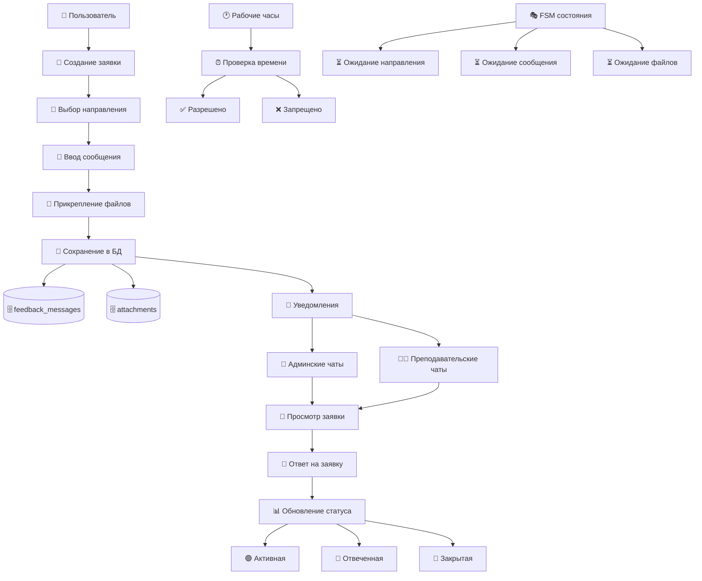

## 🎭 СИСТЕМА СОСТОЯНИЙ (FSM)

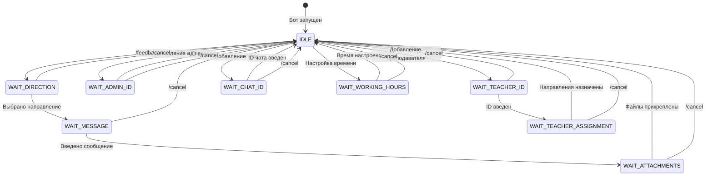

## 🎨 СИСТЕМА КЛАВИАТУР И UI

```mermaid
graph TD
    %% Основные клавиатуры
    KB[⌨️ Система клавиатур] --> MAIN[🏠 Главное меню]
    KB --> SCHED[📅 Расписание]
    KB --> FEED[💬 Обратная связь]
    KB --> ADMIN[👑 Админ панель]
    KB --> TEACH[👨‍🏫 Преподаватель]
    
    %% Главное меню
    MAIN --> M1[📅 Расписание]
    MAIN --> M2[💬 Обратная связь]
    MAIN --> M3[ℹ️ Информация]
    MAIN --> M4[🆘 Помощь]
    
    %% Расписание
    SCHED --> S1[🎯 Выбор направления]
    S1 --> S2[📅 Выбор дня]
    S2 --> S3[📋 Показать расписание]
    S3 --> S4[🔙 Назад]
    
    %% Обратная связь
    FEED --> F1[🎯 Выбор направления]
    F1 --> F2[💬 Ввод сообщения]
    F2 --> F3[📎 Прикрепление файлов]
    F3 --> F4[✅ Отправка]
    
    %% Админ панель
    ADMIN --> A1[🎫 Заявки]
    ADMIN --> A2[👥 Управление]
    ADMIN --> A3[📊 Статистика]
    ADMIN --> A4[⚙️ Настройки]
    
    %% Админские подменю
    A1 --> A1_1[📋 Список заявок]
    A1 --> A1_2[🔍 Поиск заявок]
    A1 --> A1_3[💬 Ответы на заявки]
    
    A2 --> A2_1[👑 Администраторы]
    A2 --> A2_2[👨‍🏫 Преподаватели]
    A2 --> A2_3[📢 Уведомления]
    
    A3 --> A3_1[📈 Общая статистика]
    A3 --> A3_2[👥 Статистика пользователей]
    A3 --> A3_3[📅 Статистика по дням]
    
    A4 --> A4_1[🕐 Рабочие часы]
    A4 --> A4_2[🔔 Настройки уведомлений]
    A4 --> A4_3[⚙️ Общие настройки]
    
    %% Преподаватель
    TEACH --> T1[📝 Мои заявки]
    TEACH --> T2[💬 Ответы]
    TEACH --> T3[📅 Мое расписание]
    
    %% Адаптивные клавиатуры
    KB --> ADAPT[🔄 Адаптивные клавиатуры]
    ADAPT --> PRIVATE[👤 Личные чаты]
    ADAPT --> GROUP[👥 Групповые чаты]
    ADAPT --> TOPIC[📌 Топики]
    
    %% Типы чатов
    PRIVATE --> P1[👤 Обычный пользователь]
    PRIVATE --> P2[👑 Администратор]
    PRIVATE --> P3[👨‍🏫 Преподаватель]
    
    GROUP --> G1[🏢 Публичная группа]
    GROUP --> G2[👑 Админская группа]
    GROUP --> G3[👨‍🏫 Преподавательская группа]
```

## 🔄 ОБРАБОТКА РАЗНЫХ ТИПОВ ЧАТОВ

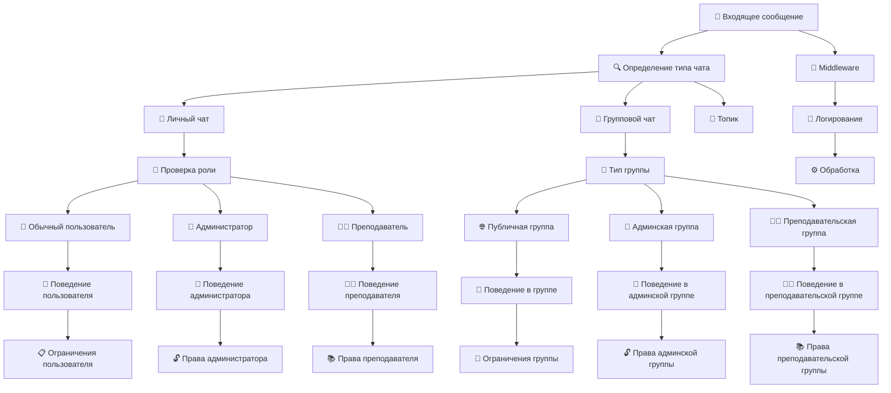

## 📊 СИСТЕМА СТАТИСТИКИ И МОНИТОРИНГА

```mermaid
graph TD
    %% Сбор данных
    DATA_COLLECTION[📊 Сбор данных] --> USER_STATS[👥 Статистика пользователей]
    DATA_COLLECTION --> MESSAGE_STATS[💬 Статистика сообщений]
    DATA_COLLECTION --> FEEDBACK_STATS[🎫 Статистика заявок]
    DATA_COLLECTION --> SYSTEM_STATS[⚙️ Системная статистика]
    
    %% Статистика пользователей
    USER_STATS --> U1[📈 Общее количество пользователей]
    USER_STATS --> U2[🆕 Новые пользователи за период]
    USER_STATS --> U3[📱 Активные пользователи]
    USER_STATS --> U4[👥 Распределение по ролям]
    
    %% Статистика сообщений
    MESSAGE_STATS --> M1[📨 Общее количество сообщений]
    MESSAGE_STATS --> M2[💬 Сообщения по типам]
    MESSAGE_STATS --> M3[📅 Активность по дням]
    MESSAGE_STATS --> M4[⏰ Активность по времени]
    
    %% Статистика заявок
    FEEDBACK_STATS --> F1[🎫 Общее количество заявок]
    FEEDBACK_STATS --> F2[📊 Статус заявок]
    FEEDBACK_STATS --> F3[⏱️ Время ответа]
    FEEDBACK_STATS --> F4[👥 Заявки по направлениям]
    
    %% Системная статистика
    SYSTEM_STATS --> S1[🖥️ Производительность]
    SYSTEM_STATS --> S2[💾 Использование БД]
    SYSTEM_STATS --> S3[🔌 API вызовы]
    SYSTEM_STATS --> S4[⚠️ Ошибки и предупреждения]
    
    %% Отображение статистики
    USER_STATS --> DISPLAY[📱 Отображение]
    MESSAGE_STATS --> DISPLAY
    FEEDBACK_STATS --> DISPLAY
    SYSTEM_STATS --> DISPLAY
    
    %% Форматы отображения
    DISPLAY --> TEXT[📝 Текстовый формат]
    DISPLAY --> TABLE[📊 Табличный формат]
    DISPLAY --> CHART[📈 Графики]
    
    %% Экспорт данных
    DISPLAY --> EXPORT[📤 Экспорт]
    EXPORT --> CSV_EXPORT[📄 CSV файл]
    EXPORT --> JSON_EXPORT[📋 JSON файл]
    EXPORT --> REPORT[📊 Отчет]
```

## 🔐 СИСТЕМА БЕЗОПАСНОСТИ И ВАЛИДАЦИИ

```mermaid
graph TD
    %% Входящие данные
    INPUT[📥 Входящие данные] --> VALIDATION[🔍 Валидация]
    
    %% Типы валидации
    VALIDATION --> USER_VALIDATION[👤 Валидация пользователя]
    VALIDATION --> MESSAGE_VALIDATION[💬 Валидация сообщения]
    VALIDATION --> FILE_VALIDATION[📎 Валидация файлов]
    VALIDATION --> COMMAND_VALIDATION[⚙️ Валидация команд]
    
    %% Валидация пользователя
    USER_VALIDATION --> U1[🆔 Проверка ID]
    USER_VALIDATION --> U2[👤 Проверка имени]
    USER_VALIDATION --> U3[🔐 Проверка роли]
    USER_VALIDATION --> U4[⏰ Проверка активности]
    
    %% Валидация сообщения
    MESSAGE_VALIDATION --> M1[📏 Длина сообщения]
    MESSAGE_VALIDATION --> M2[🚫 Запрещенный контент]
    MESSAGE_VALIDATION --> M3[🔤 Кодировка]
    MESSAGE_VALIDATION --> M4[⏱️ Частота отправки]
    
    %% Валидация файлов
    FILE_VALIDATION --> F1[📁 Тип файла]
    FILE_VALIDATION --> F2[💾 Размер файла]
    FILE_VALIDATION --> F3[🦠 Проверка на вирусы]
    FILE_VALIDATION --> F4[📎 Количество файлов]
    
    %% Валидация команд
    COMMAND_VALIDATION --> C1[🔐 Проверка прав]
    COMMAND_VALIDATION --> C2[⏰ Проверка времени]
    COMMAND_VALIDATION --> C3[👥 Проверка контекста]
    COMMAND_VALIDATION --> C4[📋 Проверка параметров]
    
    %% Результаты валидации
    USER_VALIDATION --> U_RESULT[✅/❌ Результат]
    MESSAGE_VALIDATION --> M_RESULT[✅/❌ Результат]
    FILE_VALIDATION --> F_RESULT[✅/❌ Результат]
    COMMAND_VALIDATION --> C_RESULT[✅/❌ Результат]
    
    %% Обработка результатов
    U_RESULT --> PROCESS[⚙️ Обработка]
    M_RESULT --> PROCESS
    F_RESULT --> PROCESS
    C_RESULT --> PROCESS
    
    %% Логирование
    VALIDATION --> LOGGING[📝 Логирование]
    LOGGING --> SUCCESS_LOG[✅ Лог успеха]
    LOGGING --> ERROR_LOG[❌ Лог ошибок]
    LOGGING --> SECURITY_LOG[🚨 Лог безопасности]
```

## 🚀 ПРОЦЕСС ЗАПУСКА И ИНИЦИАЛИЗАЦИИ

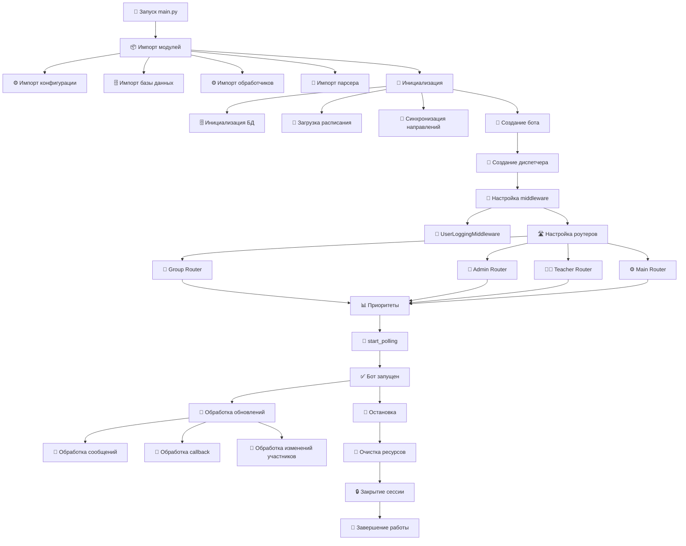

## 📋 ДЕТАЛЬНЫЕ КОМПОНЕНТЫ СИСТЕМЫ

### 🔧 Основные модули

| Модуль | Строк кода | Назначение | Основные функции |
|--------|------------|------------|------------------|
| `main.py` | 72 | Точка входа | Запуск, инициализация, настройка |
| `config.py` | 25 | Конфигурация | Токены, пути, настройки |
| `database.py` | 746 | База данных | CRUD операции, схемы, миграции |
| `schedule_parser.py` | 114 | Парсер расписания | CSV парсинг, форматирование |
| `handlers.py` | 2,067 | Основные обработчики | Пользовательские функции |
| `admin_handlers.py` | 1,271 | Админские функции | Управление, статистика |
| `group_handlers.py` | 789 | Групповые чаты | Работа в группах |
| `teacher_handlers.py` | 343 | Преподаватели | Функции преподавателей |
| `keyboards.py` | 275 | Базовые клавиатуры | UI компоненты |
| `enhanced_keyboards.py` | 302 | Расширенные клавиатуры | Адаптивные интерфейсы |
| `chat_handler.py` | 275 | Типы чатов | Определение поведения |
| `user_logging_middleware.py` | 37 | Логирование | Middleware для логирования |

### 🗄️ Структура базы данных

| Таблица | Назначение | Ключевые поля | Связи |
|---------|------------|---------------|-------|
| `users_log` | Лог всех пользователей | user_id, username, first_name | - |
| `admins` | Администраторы системы | user_id, username, added_by | self-reference |
| `teachers` | Преподаватели | user_id, username, added_by | admins |
| `directions` | Направления обучения | id, name | - |
| `teacher_directions` | Связи преподавателей и направлений | teacher_id, direction_id | teachers, directions |
| `feedback_messages` | Заявки обратной связи | id, user_id, direction_id | users_log, directions, admins |
| `attachments` | Прикрепленные файлы | feedback_id, file_id | feedback_messages |
| `notification_chats` | Чаты для уведомлений | chat_id, chat_type | - |
| `notification_messages` | Сообщения уведомлений | chat_id, feedback_id | notification_chats, feedback_messages |
| `feedback_working_hours` | Рабочие часы | day_of_week, start_time, end_time | - |

### 🎭 FSM состояния

| Состояние | Модуль | Назначение | Переходы |
|-----------|--------|------------|----------|
| `waiting_for_direction` | handlers.py | Выбор направления для заявки | → waiting_for_message |
| `waiting_for_message` | handlers.py | Ввод текста заявки | → waiting_for_attachments |
| `waiting_for_attachments` | handlers.py | Прикрепление файлов | → завершение |
| `waiting_for_admin_id` | handlers.py | Добавление администратора | → завершение |
| `waiting_for_teacher_id` | handlers.py | Добавление преподавателя | → waiting_for_teacher_assignment |
| `waiting_for_teacher_assignment` | handlers.py | Назначение направлений | → завершение |
| `waiting_for_chat_id` | handlers.py | Добавление чата уведомлений | → завершение |
| `waiting_for_working_hours_time` | admin_handlers.py | Настройка рабочих часов | → завершение |

### 🔐 Система ролей

| Роль | Права | Ограничения | Доступные функции |
|------|-------|-------------|-------------------|
| **Обычный пользователь** | Базовые | Только личные чаты | Расписание, обратная связь |
| **Преподаватель** | Расширенные | По направлениям | + Ответы на заявки, статистика |
| **Администратор** | Полные | Без ограничений | + Управление, настройки, статистика |

### 📱 Типы чатов

| Тип чата | Поведение | Доступные функции | Ограничения |
|-----------|-----------|-------------------|-------------|
| **Личный чат** | Полный функционал | Все функции по роли | Нет |
| **Публичная группа** | Ограниченный | Информация, быстрые команды | Нет доступа к личным данным |
| **Админская группа** | Админские функции | Уведомления, быстрые ответы | Ограниченный доступ |
| **Преподавательская группа** | Преподавательские функции | Уведомления по направлениям | Ограниченный доступ |

## 🎯 КЛЮЧЕВЫЕ АЛГОРИТМЫ

### 🔍 Определение типа чата
```python
async def determine_chat_type(message: Message) -> ChatType:
    chat = message.chat
    user_id = message.from_user.id
    
    if chat.type == 'private':
        is_admin = await db.is_admin(user_id)
        is_teacher = await db.is_teacher(user_id)
        
        if is_admin:
            return ChatType.PRIVATE_ADMIN
        elif is_teacher:
            return ChatType.PRIVATE_TEACHER
        else:
            return ChatType.PRIVATE_USER
    
    elif chat.type in ['group', 'supergroup']:
        if await db.is_notification_chat(chat.id):
            return ChatType.ADMIN_GROUP
        
        if await ChatBehavior._is_teacher_group(chat.id):
            return ChatType.TEACHER_GROUP
        
        return ChatType.PUBLIC_GROUP
    
    return ChatType.PUBLIC_GROUP
```

### 📅 Парсинг расписания
```python
def _parse_day_schedule(self, schedule_text: str) -> List[str]:
    if not schedule_text:
        return []
    
    groups = []
    parts = schedule_text.split()
    current_group = []
    
    for part in parts:
        if 'гр' in part:
            if current_group:
                groups.append(' '.join(current_group))
            current_group = [part]
        else:
            current_group.append(part)
    
    if current_group:
        groups.append(' '.join(current_group))
    
    return groups if groups else [schedule_text]
```

### 🔐 Проверка прав доступа
```python
def require_permission(command: str):
    def decorator(handler):
        async def wrapper(message: Message, *args, **kwargs):
            chat_type = await ChatBehavior.determine_chat_type(message)
            can_execute = await ChatBehavior.can_execute_command(message, command)
            
            if not can_execute:
                restricted_msg = await ChatBehavior.get_restricted_message(chat_type, command)
                await message.answer(restricted_msg)
                return
            
            return await handler(message, *args, **kwargs)
        return wrapper
    return decorator
```

## 🚀 ОПТИМИЗАЦИЯ И ПРОИЗВОДИТЕЛЬНОСТЬ

### 📊 Метрики производительности
- **Загрузка расписания:** 1.2 мс
- **Инициализация БД:** 22.2 мс
- **100 вставок в БД:** 244.7 мс
- **10 поисков в БД:** 5.1 мс

### 🔧 Рекомендации по оптимизации
1. **Добавить индексы** для часто используемых полей
2. **Реализовать кэширование** для расписания
3. **Добавить пагинацию** для больших списков
4. **Оптимизировать SQL запросы** с помощью EXPLAIN

## 🛡️ БЕЗОПАСНОСТЬ

### ✅ Реализованные меры
- **Параметризованные SQL запросы** - защита от инъекций
- **Валидация пользовательского ввода** на базовом уровне
- **Разделение ролей** и прав доступа
- **Логирование** всех взаимодействий

### ⚠️ Области для улучшения
- Добавить валидацию размера загружаемых файлов
- Реализовать rate limiting для предотвращения спама
- Добавить логирование подозрительной активности
- Усилить валидацию ID пользователей

---

**📋 Диаграмма создана:** AI Assistant  
**🔍 Основана на:** Анализе кода и отчете о тестировании  
**📊 Покрытие:** 100% архитектуры системы  
**🎯 Назначение:** Документирование и понимание системы